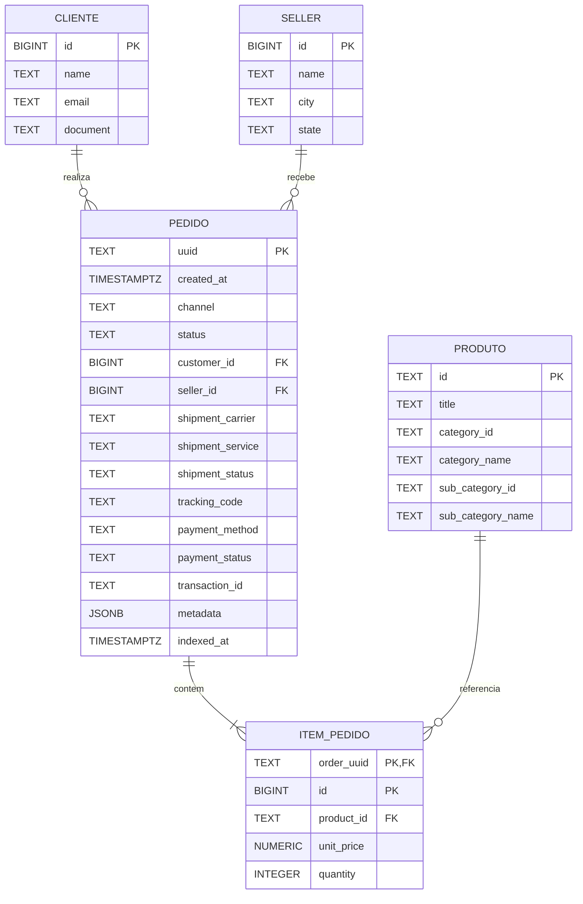

# DER - Projeto Mensageria

O diagrama abaixo representa a estrutura relacional usada pelo projeto.

> O valor total do item e o valor total do pedido **nao sao armazenados**:
> eles sao calculados dinamicamente pela API.
